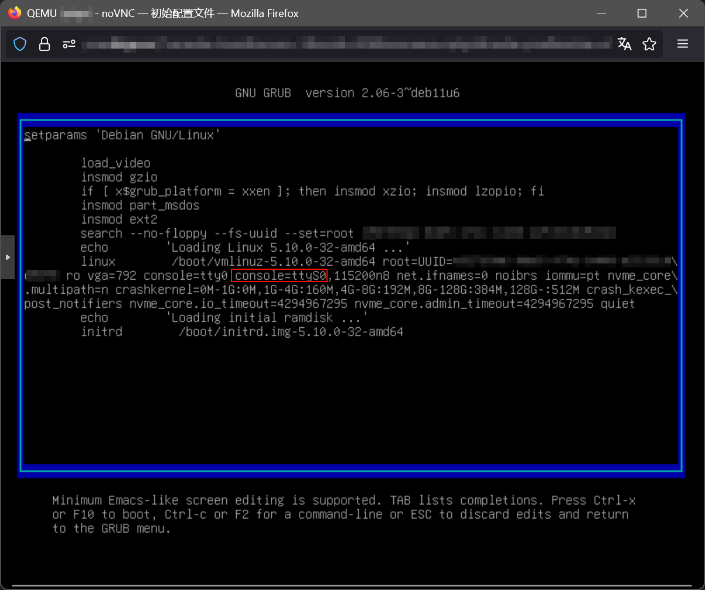
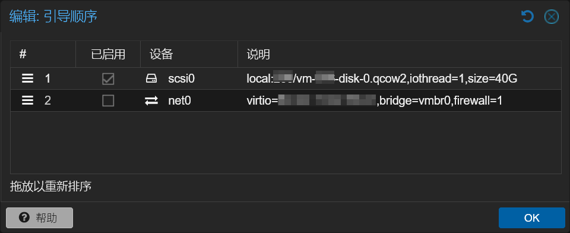
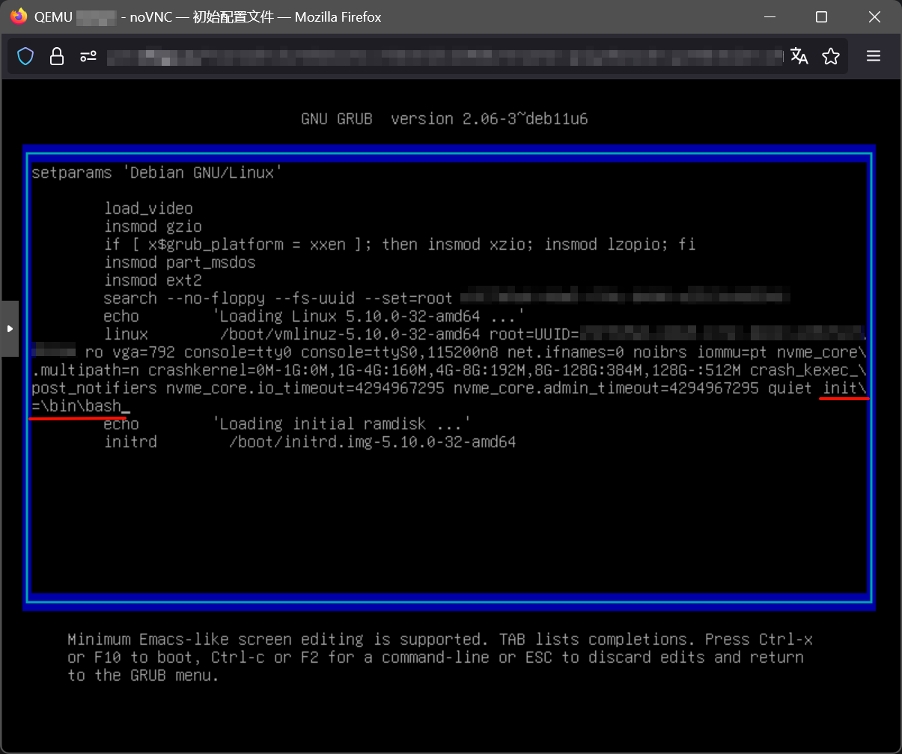
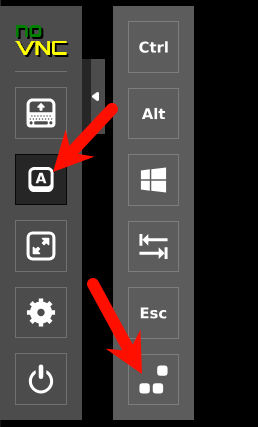

众所周知，阿里云的服务器非常贵，如果低价购买了某些规格，到期后不想续费，可以把镜像下载下来，放到家里云中运行

## 目录

[1. 系统镜像](#系统镜像)

[2. 家里云运行环境](#家里云运行环境)

[3. 虚拟机创建和配置](#虚拟机创建和配置)

[4. 系统启动](#系统启动)

---

# 系统镜像

从阿里云获取系统镜像时，需要开通对象存储OSS并创建存储桶，存储桶地区需要和镜像所在地一致

对虚拟机进行快照操作，然后通过快照创建自定义镜像

> 如果是从轻量应用服务器导出，需要在镜像页面选择共享到ECS，然后在ECS镜像页面选择复制镜像，才能进行下一步 

随后在镜像页面选择导出到OSS,镜像格式选择`qcow2`或`raw`（*推荐选择*`raw`，因为会打包压缩成`.tar.gz`，*实际体积更小*，可以`节省OSS流量`并`加快下载速度`） 

接下来就是下载镜像了，可以直接下载（阿里云OSS标准冗余存储的流量按量付费是`每GB扣0.5`），也可以用同地域的服务器中转下载来规避流量费

下载好之后把镜像传到家里云上就好啦，raw格式的记得`解压`

---

# 家里云运行环境

我在家里云使用的是`Proxmox VE 8`，管理器版本`8.4.9`，内核使用`6.14.8-2-bpo12-pve`

---

# 创建和配置虚拟机

创建一个虚拟机，可以先不附加磁盘。

因为阿里云镜像中默认配置了串口控制台，可以比较方便的使用`xterm.js`，但是在此之前还需要添加一个`串口`才能使用。



添加一个串口，串口号填写`0`。


### 将磁盘附加到虚拟机

### 在执行下方操作前，确认raw格式的镜像已解压，并确认要挂载的虚拟磁盘格式

如果镜像格式与需要的格式不一致，需要先转换格式

```bash
qemu-img convert -f <原格式> -O <目标格式> <输入镜像> <输出镜像>
```

> 如果刚刚添加了虚拟磁盘，删掉原本的虚拟磁盘并将镜像重命名成原来的虚拟磁盘

> 如果刚刚没有添加虚拟磁盘，执行以下命令附加虚拟磁盘
> 
> ```bash
> qm importdisk <vmid> <images-name> <storage pool> --format=<disk-fs>
> ```
> 
> vmid是刚刚创建的虚拟机id，images-name是磁盘镜像，storage pool选择存储池，disk-fs是虚拟产品格式
> 
> 然后在控制台打开虚拟机的硬件选项卡，会出现“未使用的磁盘”，双击附加到虚拟机

打开虚拟机的“选项”，双击引导顺序，确认引导正确



---

# 系统启动

由于阿里云镜像中存在`阿里云专用cloud-init`，直接启动会有一点点小问题，在noVNC中光标闪烁但未进入登录页，在xterm.js中会有如下循环输出

```log
[   27.528546] cloud-init[473]: 2025-08-30 16:07:23,422 - url_helper.py[WARNING]: Calling 'http://100.100.100.200/2016-01-01/meta-data/instance-id' failed [23/300s]: request error [HTTPConnectionPool(host='100.100.100.200', port=80): Max retries exceeded with url: /2016-01-01/meta-data/instance-id (Caused by ConnectTimeoutError(<urllib3.connection.HTTPConnection object at 0x7f89580b1e20>, 'Connection to 100.100.100.200 timed out. (connect timeout=5.0)'))]
```

这是阿里云专用cloud-inti在尝试连接`内网`100.100.100.200的`cloud-init服务器`，但是在私有环境下`不存在`，该过程会循环重试两次，每次5分钟（300秒），这就导致需要`等待10分钟`才能进入系统

所以我们需要进行一个修改，进入`救援模式`禁用掉相关服务

1. 打开`noVNC`连接，并在noVNC中启动虚拟机（不建议连接前就打开虚拟机，可能会错过grub，同时建议质直连pve时操作，避免CDN导致操作延迟）
2. 不断按下`ESC`键，进入grub后按`e`修改启动配置
3. 在`Linux行末`添加`init=/bin/bash`

4. 按下`Ctrl + X`进入救援模式
5. 查看分区情况`df`或`lsblk`,找到挂载为`/`的分区
6. 重新挂载根分区为可写`mount -O remount,rw <根分区>`
7. 查看systemd启用情况`systemctl list-unit-files --type=service --state=enabled`
8. 禁用掉阿里云相关内容`systemctl disable <service name>`
- aliyun.service 
- cloud-config.service
- cloud-final.service
- cloud-init-local.service
- cloud-init.service
- ecs_mq.service

可选操作：

1. 修改密码，`忘记密码`或者为了`方便xterm.js`，使用`passwd`修改密码
2. 修改公钥，避免在云上时和别人共用导致别人也能登录

完成以上操作后，通过`Ctrl + Alt + Delete`重启系统


然后就可以正常进入系统登录了

登录后将软件源从`阿里云内网源`改为自己常用的源，然后就可以愉快的 `apt update`啦，再`apt install qemu-guest-agent -y`把agent装上，完事。