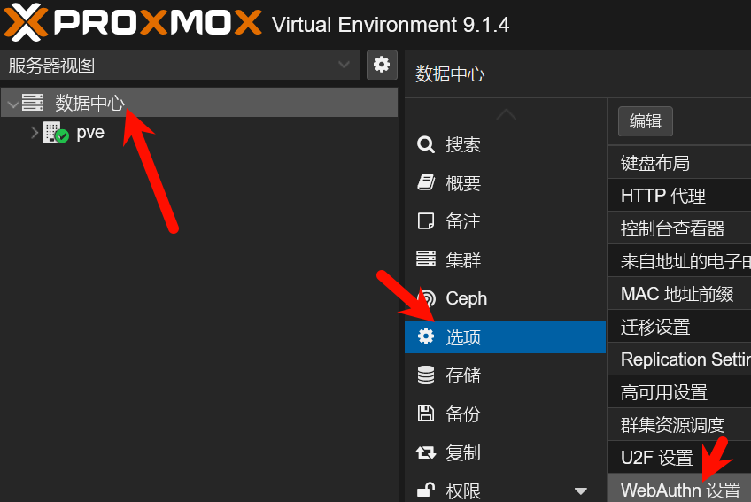
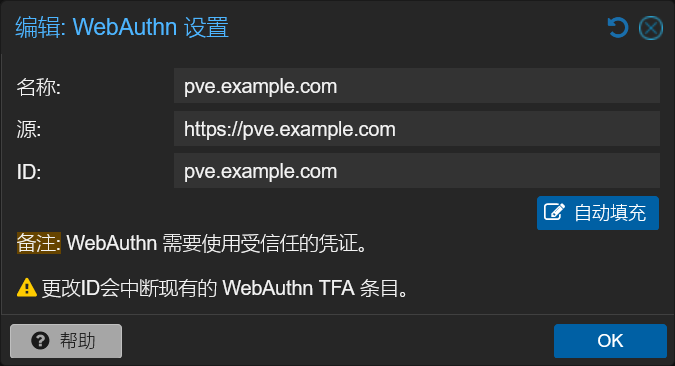
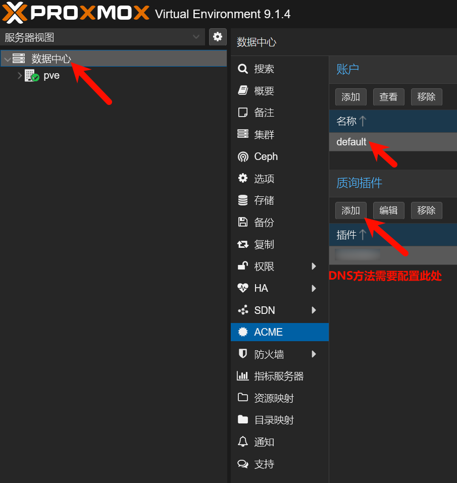
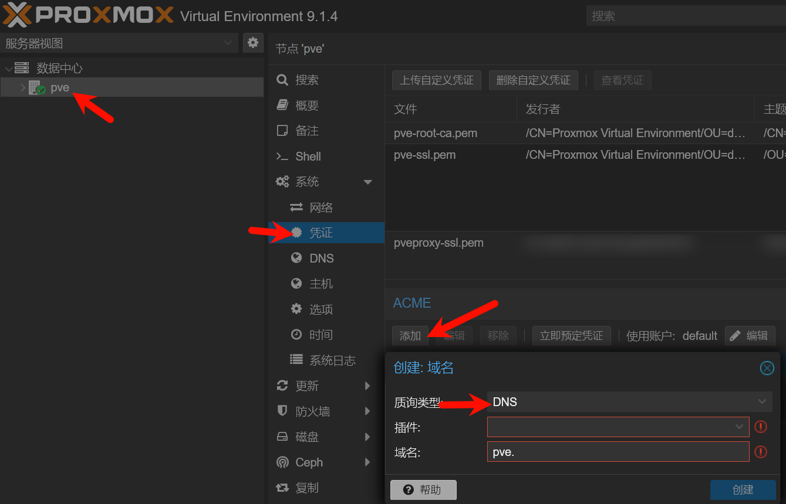
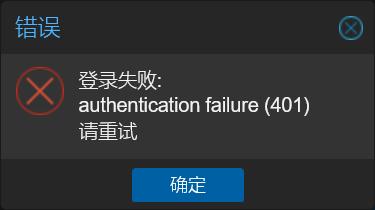

家里云（PVE）设置了两步验证后，使用passkey来快速且便利地完成身份验证。但是通常情况下一个端点只能对应一个域名，在内网和公网同时使用的情况下不易配置。  

## 目录  

[1.WebAuthn配置](#webauthn配置)  
[2.PVE域名和证书](#pve域名和证书)  
[3.验证可行性](#验证可行性)  
[4.修复问题](#修复问题)  
[5.参考资料](#参考资料)  

---

# WebAuthn配置  

配置WebAuthn需要这三个内容  

| 内容 | 描述 | 说明 |
| :---: | :---: | :---: |
| name | 端点名称 | 注册passkey的名称 |
| id | 依赖方ID（即识别WebAuthn的唯一ID） | 只能是唯一主机名 |
| origns | passkey请求来源 | 允许使用当前passkey的主机名，此内容并非WebAuth中存在\* |

> \* 来源应为位于`/.well-known/webauthn`的json文件，如对于 example.com 的 rpID，文件必须在`https://example.com/.well-known/webauthn` （注意：没有 .json 扩展名）上 [^1][1]


由于我使用**Firefox**，并未实现这种多源实现，所以我们使用另一种WebAuthn机制:  

默认情况下，rpID 是创建 Passkey 的源的有效域。WebAuthn 的范围规则允许一个源设置一个等于其自身域或其可注册域后缀的 rpID  

也就是说如果你讲rpID设置为`example.com`，那么实际上包含`example.com和*.example.com`（此处通配符\*可以匹配多级域名而不是像TLS证书一样只能匹配一级）  
利用这个机制，只需要rpID对应主机名是公网可以访问的，下级域名也就可以使用这个rpID来完成WebAuthn流程。  

---

# PVE域名和证书  

WebAuthn要求必须具有可信证书才能进行，所以需要配置好域名和证书  

## 设置域名  

进入pve的 数据中心-选项

根据上文提到的机制，设置`pve.example.com`为rpID并确保公网可以访问位于`https://pve.example.com`的管理页面~~都公网了就用443端口吧~~，内网则使用`https://local.pve.example.com:8006`来访问，这个域名解析到内网IP上  


## 设置证书  
在pve通过acme签发证书（当然你也可以用别的方法来获取证书，但是**必须是可信证书**否则浏览器会**拒绝WebAuthn请求**）  
先把账户和DNS管理API配置好（如果你所有主机名的80端口都能通过公网访问就不需要配置质询插件）  

添加主机名，注意质询方法别选错（主机名的80端口能通过公网访问可以用HTTP质询，注意80端口空闲即可）  
> [!TIP]
> pve内置的acme不支持签发通配符证书，所以需要手动把需要的域名逐个添加进去


点`立即预订凭证`来让pve自动获取Let's Encrypt签发的证书  

---

# 验证可行性  
通过公网主机`pve.example.com`访问，passkey可以正常注册和完成验证  
通过内网主机`local.pve.example.com`访问，passkey可以完成验证但是提示401  

查看network中对`/api2/extjs/access/ticket`进行POST请求的详情，状态200，请求体正常，响应体如下  
```json
{
    "status": "401",
    "data": null,
    "success": 0,
    "message": "authentication failure\n"
}
```
说明浏览器的源验证能通过，但是服务端的没有通过  

---

# 修复问题  

尝试修改WebAuthn的源如下  
 - `https://pve.example.com;https://local.pve.example.com`  
 - `https://pve.example.com;https://local.pve.example.com:8006`  
 - `https://pve.example.com:8006`  
均不能按照预期工作，将配置还原  

尝试将443端口上的请求转发到8006端口上  
```bash
# ipv4
iptables -t nat -A PREROUTING -p tcp --dport 443 -j REDIRECT --to-ports 8006
# ipv6
ip6tables -t nat -A PREROUTING -p tcp --dport 443 -j REDIRECT --to-ports 8006
```

访问`local.pve.example.com`（此次不带端口号走443），发现WebAuthn可以正常完成验证和注册  
将端口转发规则持久化到pve中（当然也可以配置反代，但是**十分不推荐**在pve母鸡中安装任何多余的应用）  
原地复制`/etc/network/interfaces`文件为`interfaces.new`并编辑`interfaces.new`，在母鸡网络出口虚拟网卡的iface字段后添加下面的内容（注意缩进）  
```interfaces.new
# 443 TO 8006
# ipv4
        post-up iptables -t nat -A PREROUTING -p tcp --dport 443 -j REDIRECT --to-ports 8006
        post-down iptables -t nat -D PREROUTING -p tcp --dport 443 -j REDIRECT --to-ports 8006
# ipv6
        post-up ip6tables -t nat -A PREROUTING -p tcp --dport 443 -j REDIRECT --to-ports 8006
        post-down ip6tables -t nat -D PREROUTING -p tcp --dport 443 -j REDIRECT --to-ports 8006
```
然后在节点的网络选项中选择应用配置

---

# 参考资料  
[1]: https://www.corbado.com/zh/blog/webauthn-%E5%85%B3%E8%81%94%E6%BA%90-%E8%B7%A8%E5%9F%9F-passkeys "WebAuthn 关联源：跨域 Passkey 指南"  
\[1\][WebAuthn 关联源：跨域 Passkey 指南](https://www.corbado.com/zh/blog/webauthn-%E5%85%B3%E8%81%94%E6%BA%90-%E8%B7%A8%E5%9F%9F-passkeys)  
\[2\][Web Authentication API](https://mdn.org.cn/en-US/docs/Web/API/Web_Authentication_API)  
\[3\][Web Authentication API](https://developer.mozilla.org/zh-CN/docs/Web/API/Web_Authentication_API)